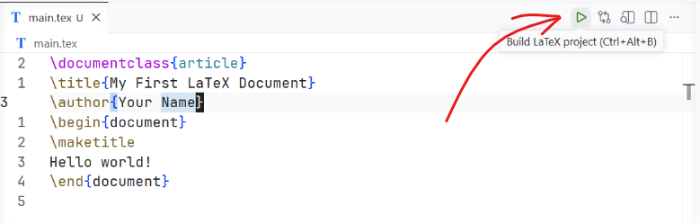
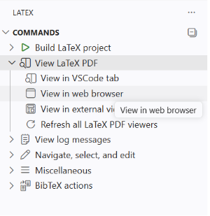

# Lab Report LaTeX Starter
This is a public template for writing lab reports using LaTeX for university students.

## Pre-requisites
- LaTeX Compiler
  - Windows: [MikTex](https://miktex.org/download)
  - Mac: [MacTex](https://www.tug.org/mactex/mactex-download.html)
  - Linux: `sudo apt install texlive-full` (or your distro's equivalent)

- Packages
  - Formatter: `latexindent`

- VS Code Extensions
  - LaTeX Workshop: `ext install James-Yu.latex-workshop` (to be run from the command palette)

## Setup

Clone this repo:

```sh
git clone https://github.com/t4snimul/lab-report-latex-starter.git
```

Open `main.tex` and click `play` icon.



Go to the `TEX` tab from the activity bar and select `view in web browser`


